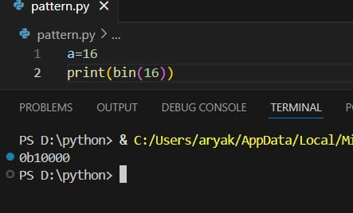
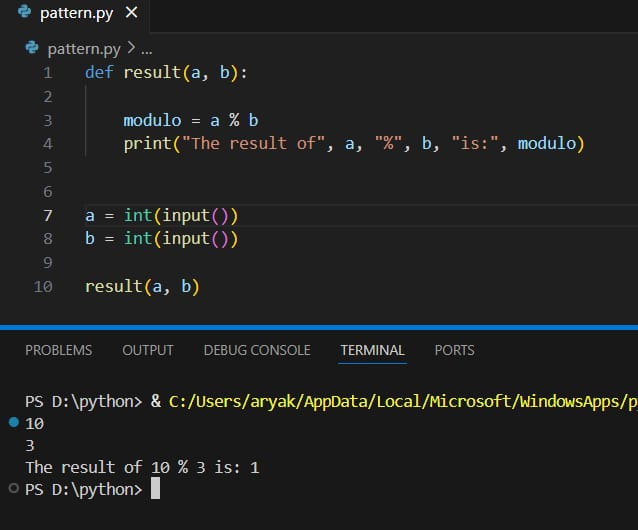
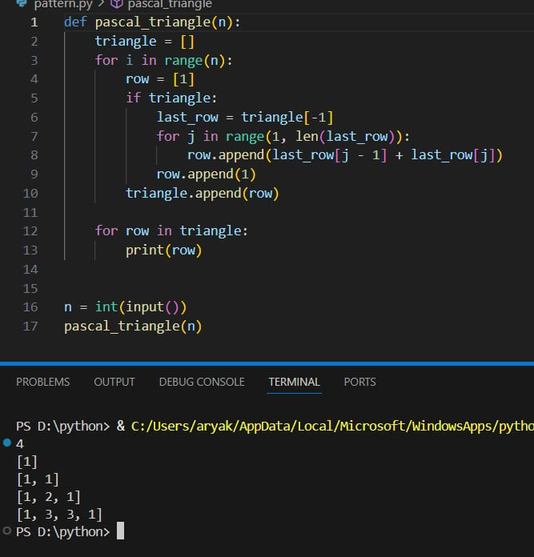

# Date:12/9/2025
# Pg1
# Built-in Functions -Binary Conversion Using Built-in Functions in Python
# Aim
To write a Python program to convert the number 16 into its binary representation using built-in Python functions.

# Algorithm
Assign the value 16 to a variable a.
Use the built-in bin() function to convert the number to binary.
Print the result.
# Program
```
a=16
print(bin(16))
```
# Output

# Result
Thus,the required program is execued successfully.
# Pg2
Functions in Python: Modulo Calculator
# Aim
To write a Python program that defines a function which accepts two values and returns their modulo using the % operator.

# Algorithm
Define a function called result that takes two arguments a and b.
Inside the function, compute the modulo using a % b.
Print the result of the modulo operation.
Get two integer inputs from the user.
Call the result function with the user-provided values.
# Program
```
def result(a, b):
    modulo =a % b
    print("The result of", a, "%", b, "is:”,modulo)
a = int(input())
b= int(input())
result(a, b)
```
# Output


# Result
Thus,the required program is execued successfully.
# Pg3
# Lambda Function in Python: Addition of Two Numbers
# Aim
To write a Python program that defines a lambda function which takes two arguments a and b, and returns their sum.

# Algorithm
Get two integer inputs from the user.
Use a lambda function to define a function f that returns a + b.
Call the function with the user inputs and print the result.
# Program
```
a=int(input())
b=int(input())
f= lambda a,b: a+b
print(f(a,b))
```
# Output  
 

# Result
Thus,the required program is execued successfully.

# pg:4 
# Looping(Patterns)-Pascal's Triangle Generator in Python
This project demonstrates a simple Python program to generate Pascal’s Triangle, where the number of rows is provided by the user.

# Aim
To write a Python program that generates Pascal's Triangle using numbers. The number of rows is accepted from the user.

# Algorithm
Start the program.
Input the number of rows from the user.
Loop from 0 to the number of rows.
For each row:
Print appropriate spaces to shape the triangle.
Compute values using the formula:
[ C(n, k) = \frac{n!}{k!(n-k)!} ]
Print all rows of Pascal’s Triangle.
End the program.
# Program
```
def pascal_triangle(n)：
    triangle =[]
    for i in range(n)：
        row = [1]
    if triangle:
        last row = triangle[-1]
        for j in range(1, len(last_row))：
            row.append(last_row[j - 1] +last_row[j])
        row.append(1)
    triangle. append(row)
    for row in triangle:
        print(row)
n = int(input())
pascal_triangle(n)
```
# Sample Output

# Result
Thus,the required program is execued successfully.
# pg:5
# Loops in Python: Palindrome Number Checker
# Aim
To write a Python program that checks whether a given number is a palindrome using loops.

# Algorithm
Get input from the user and assign it to a variable num.
Assign the value of num to a temporary variable temp.
Initialize a variable rev to 0 (used to store the reversed number).
Use a while loop to reverse the digits:
While temp > 0:
rev = (10 * rev) + temp % 10
temp = temp // 10
After the loop, compare rev with num:
If equal, print that the number is a palindrome.
Else, print that it is not a palindrome.
# Program
```
n=int(input())
original=n
sum=0
while n>0:
    rem=n%10
    sum=sum*10 + rem
    n=n//10
if original==sum:
    print(f"The given number {original} is a Palindrome")
else:
    print(f"The given number {original} is not a palindrome")
```

# Output

# Result
Thus,the required program is execued successfully.

